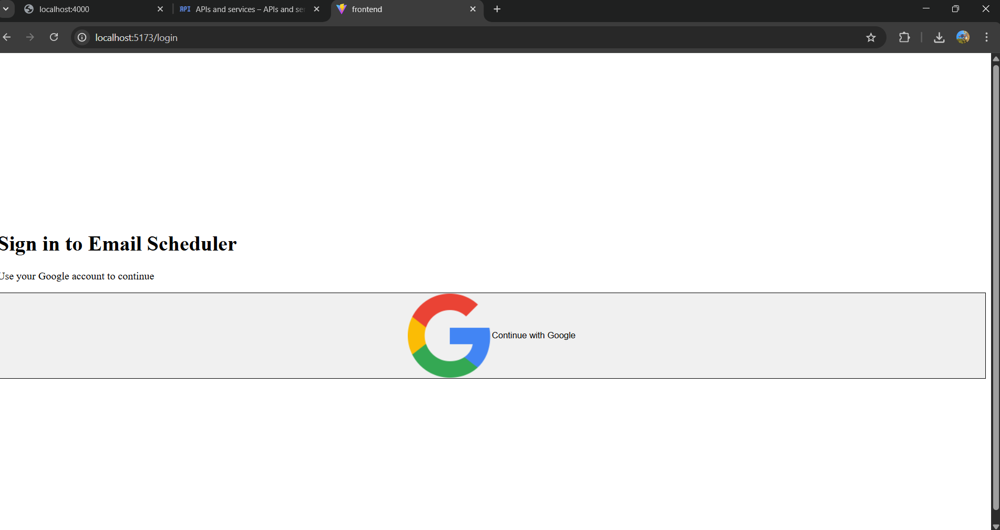
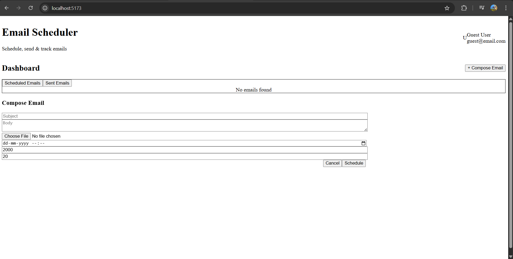
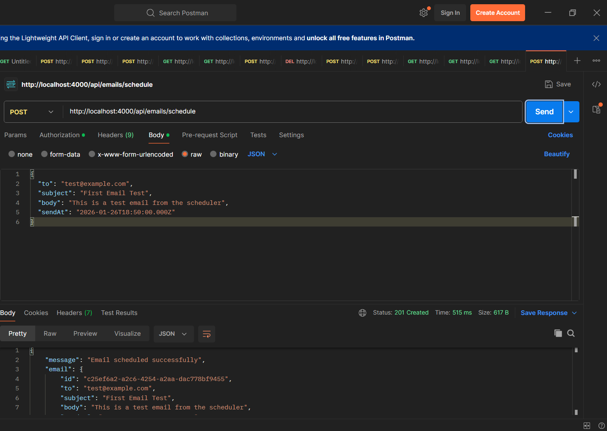
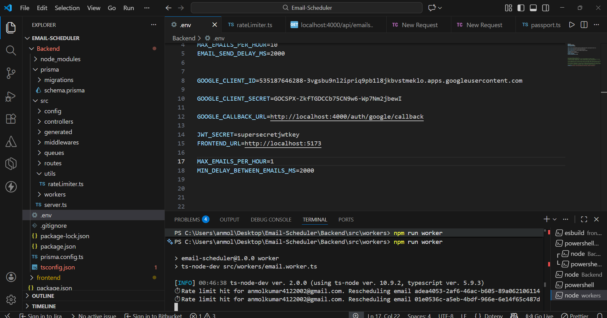
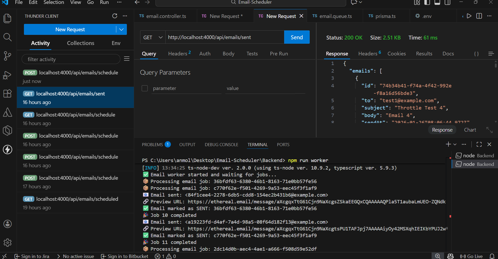

# Email Scheduler Service

A production-grade email scheduling system built with TypeScript, BullMQ, Redis, PostgreSQL, and React.

This project demonstrates how real-world email systems schedule, throttle, and send emails reliably without cron jobs.

---

## Features

- Schedule emails for a specific future time
- Persistent job scheduling using BullMQ + Redis (no cron)
- Rate limiting (emails per hour)
- Delay between individual email sends
- Automatic rescheduling when limits are exceeded
- Google OAuth authentication
- Dashboard to view scheduled and sent emails
- CSV upload for bulk email scheduling
- Survives server restarts without losing jobs

---

## Tech Stack

### Backend
- TypeScript
- Node.js + Express
- BullMQ (Redis-backed queue)
- Redis
- PostgreSQL
- Prisma ORM
- Nodemailer (Ethereal SMTP)
- Google OAuth + JWT

### Frontend
- React + Vite
- TypeScript
- Tailwind CSS

---

## Architecture Overview

Client (React)
|
| REST API (JWT Auth)
v
Express Backend
|
| DB writes (Email metadata)
v
PostgreSQL
|
| Job scheduling
v
BullMQ Queue (Redis)
|
| Worker processes
v
Email Worker → Ethereal SMTP

---

## Email Scheduling Flow

1. User logs in via Google OAuth
2. User uploads CSV and schedules emails
3. Backend:
   - Saves email records in PostgreSQL
   - Adds delayed jobs to BullMQ
4. Worker:
   - Picks jobs at scheduled time
   - Enforces rate limits and delays
   - Sends email via SMTP
   - Updates status in DB

---

## Screenshots

### Login (Google OAuth)

### Dashboard

### Schedule Email

### Scheduled Emails

### Sent Emails

## Rate Limiting Logic

- Configurable via environment variables:

MAX_EMAILS_PER_HOUR  
MIN_DELAY_BETWEEN_EMAILS_MS

- Redis is used to maintain counters per hour
- If limit is exceeded:
  - Job is NOT dropped
  - Job is delayed into the next available hour
- This logic is safe across multiple workers

---

## Persistence Guarantee

- Jobs are stored in Redis
- Email state is stored in PostgreSQL
- On server restart:
  - Scheduled jobs resume correctly
  - Emails are not duplicated
  - Already sent emails are not reprocessed

---

## Environment Variables

Backend `.env`:

PORT=4000  
DATABASE_URL=postgresql://...  
REDIS_HOST=localhost  
REDIS_PORT=6379  

GOOGLE_CLIENT_ID=...  
GOOGLE_CLIENT_SECRET=...  

JWT_SECRET=...  

ETHEREAL_USER=...  
ETHEREAL_PASS=...  

MAX_EMAILS_PER_HOUR=20  
MIN_DELAY_BETWEEN_EMAILS_MS=2000  

---

## How to Run Locally

### 1. Start services

docker start email-scheduler-postgres  
docker start email-scheduler-redis  

### 2. Backend

cd Backend  
npm install  
npm run dev  

### 3. Worker

npm run worker  

### 4. Frontend

cd frontend  
npm install  
npm run dev  

---

## Trade-offs & Notes

- CSV parsing is client-side for simplicity
- Ethereal SMTP is used for safe testing
- No cron jobs used (BullMQ only)
- UI focuses on clarity over heavy animations

---

## Outcome

This project represents a realistic slice of a production email system, demonstrating:
- Background job processing
- Rate limiting
- Fault tolerance
- Clean backend/frontend separation

## AI Usage(ChatGpt)

AI tools were used as a productivity aid during development to speed up debugging, refactoring, and documentation, while core system design and implementation were handled independently.

## Practical use of AI during development
- Debugging queue processing, Redis state, and worker execution issue
- Validating rate-limiting logic and delayed job behavior
- Refactoring TypeScript code for readability and maintainability
- Improving error handling and logging for production scenarios
- Assisting with technical documentation and README structuring

The project reflects hands-on experience in designing and building a scalable email scheduling 
